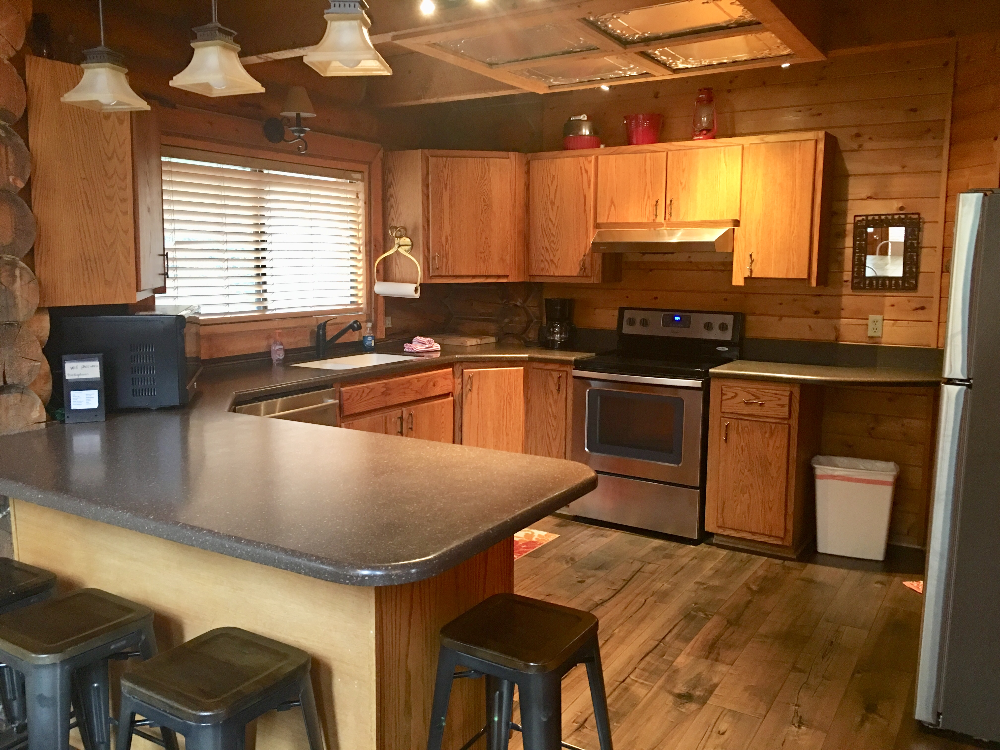

# sundance
<link rel="stylesheet" href="css/style.css">
<link rel="stylesheet" href="css/lightbox.min.css">

  

      

          

              

                  

                      

                        
                      

                  

              

          

          

              

                  

                      

                               
                      

                  

              

          

          

              

                  

                      

                          
                      

                  

              

          

          

              

                  

                      

                          
                      

                  

              

          

          

              

                  

                      

                          
                      

                  

              

          

          

              

                  

                      

                          
                      

                  

              

          

          

              

                  

                      

                          
                      

                  

              

          

          

              

                  

                      

                          
                      

                  

              

          

          

              

                  

                      

                          
                      

                  

              

          

          

              

                  

                      

                          
                      

                  

              

          

          

              

                  

                      

                          
                      

                  

              

          

          

              

                  

                      

                          
                      

                  

              

          

          

              

                  

                      

                          <a href="img/cabin19.jpg" data-lightbox="mygallery"</a>
                      

                  

              

          

          

              

                  

                      

                          
                      

                  

              

          

          

              

                  

                      

                          
                      

                  

              

          

          

              

                  

                      

                          
                      

                  

              

          

      

  

